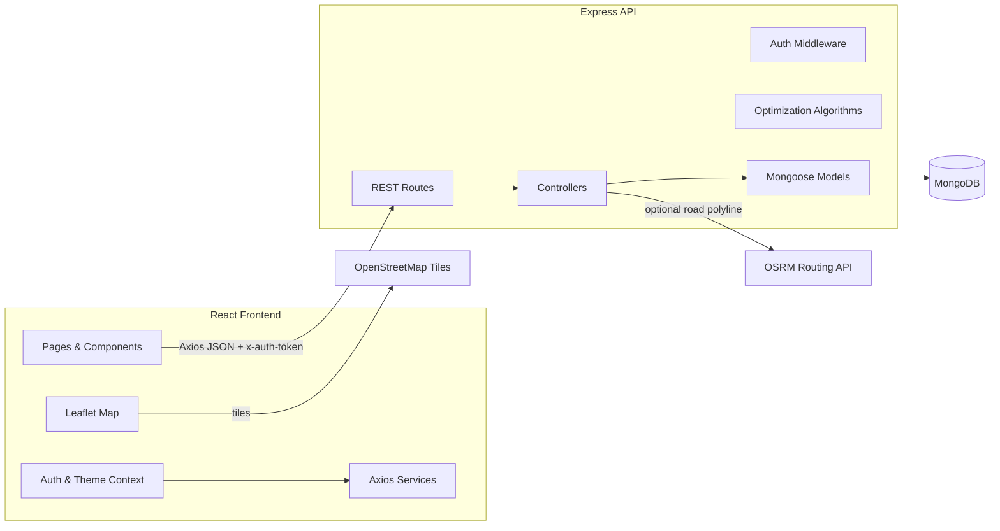

## Part 1: Comprehensive Project Breakdown

### 1. Project High-Level Overview
- **Project Title:** RouteOptimizer: Capacitated Vehicle Routing Web App
- **Elevator Pitch:** A full‑stack web application that helps logistics teams plan efficient, capacity‑aware delivery routes. Users manage vehicles and locations, run optimization algorithms, and visualize routes on an interactive map with optional real‑road routing.
- **Core Features:**
  - **User authentication** with JWT and persisted preferences (theme, default algorithm, road network preference)
  - **Vehicle management** (capacity, fleet size, max distance)
  - **Location management** with map/geocoding and depot selection
  - **Route optimization** (Clarke‑Wright Savings, Nearest‑Neighbor) + local search improvements (2‑opt/3‑opt)
  - **Interactive map visualization** using Leaflet with optional OSRM road‑routed polylines
- **Target User:** Operations teams, dispatchers, and developers building logistics/delivery routing solutions (SMBs to mid‑market) who need quick, pragmatic, capacity‑aware routing.

### 2. Technology Stack & Architecture
- **Technology Stack**

| Technology | Category | Purpose & Rationale |
|---|---|---|
| React | Frontend Library | Component-based SPA for fast UI iteration and stateful views; large ecosystem and dev tooling |
| React Router DOM | Frontend Routing | Client-side routing for protected routes and multi-page flows |
| Axios | HTTP Client | Interceptors for token injection and standardized error handling |
| Leaflet + react-leaflet | Mapping | Open-source, lightweight, and flexible map rendering and vector overlays |
| Leaflet Control Geocoder + Nominatim | Geocoding | Free OSM-based geocoding for search and reverse geocoding in forms |
| React-Toastify | UX/Notifications | Non-intrusive toasts to communicate async results and errors |
| Tailwind CSS | Styling | Utility-first styling for rapid UI construction and dark mode toggling |
| Node.js | Runtime | JS end-to-end; single language across stack |
| Express | Backend Framework | Simple, minimal REST API with middleware ecosystem |
| MongoDB | Database | Flexible document model for nested route structures and rapid iteration |
| Mongoose | ODM | Schemas, validation, and population for MongoDB documents |
| JSON Web Tokens (JWT) | Auth | Stateless, scalable authentication with signed tokens |
| bcryptjs | Security | Password hashing with salt and cost factor |
| dotenv | Config | Environment variable management across environments |
| CORS | HTTP | Development cross-origin support from `localhost:3000` to API |
| OSRM (public demo) | Routing Service | Optional real-road polyline and metrics; can self-host for reliability |

- **Project Architecture**



- **How parts interact:**
  - React pages call Axios services; an interceptor attaches the JWT in `x-auth-token`.
  - Express routes validate auth via middleware, delegate to controllers, and read/write via Mongoose models.
  - Optimization algorithms run server-side (Clarke‑Wright or Nearest‑Neighbor), storing route outputs in MongoDB.
  - Leaflet renders markers and polylines; optionally fetches OSRM road-routed geometry via an API endpoint.

- **Directory Structure (key paths)**
  - `backend/`
    - `server.js`: Express app bootstrap, route mounting, MongoDB connection
    - `routes/`: REST route definitions
      - `auth.js`, `vehicles.js`, `locations.js`, `optimization.js`
    - `controllers/`: Request handlers/business logic
      - `auth.js`, `vehicles.js`, `locations.js`, `optimization.js`
    - `models/`: Mongoose schemas
      - `User.js`, `Vehicle.js`, `Location.js`, `Optimization.js` (with embedded `RouteSchema`)
    - `middleware/auth.js`: JWT verification via `x-auth-token`
    - `setup-env.js`: Script to generate a default `.env`
    - `package.json`: API scripts and deps
  - `frontend/`
    - `src/`
      - `App.js`: App shell and React Router setup
      - `components/`: `Map.js`, `Navbar.js`, `PrivateRoute.js`, `LocationSearch.js`, `ToastProvider.js`
      - `pages/`: `Home.js`, `Login.js`, `Register.js`, `Dashboard.js`, `Vehicles.js`, `VehicleForm.js`, `Locations.js`, `LocationForm.js`, `Optimizations.js`, `NewOptimization.js`, `OptimizationDetail.js`, `Settings.js`
      - `services/`: `api.js`, `auth.service.js`, `vehicle.service.js`, `location.service.js`, `optimization.service.js`
      - `context/`: `AuthContext.js`, `ThemeContext.js`
      - `styles/`: CSS for pages/components
    - `tailwind.config.js`, `postcss.config.js`: Tailwind setup

### 3. Detailed Data Flow
- **A. Authentication (Register/Login, Preferences)**
  1. Frontend: In `Register.js` and `Login.js`, user submits form; `AuthContext.js` calls `auth.service.js` (`POST /auth/register` or `POST /auth/login`).
  2. API Call: Axios (`frontend/src/services/api.js`) injects `x-auth-token` when present; errors with 401 trigger token removal and redirect to `/login`.
  3. Backend Controller: `backend/controllers/auth.js` validates user:
     - Register: ensures unique email; saves user; returns JWT signed with `JWT_SECRET` (5-day expiry).
     - Login: checks user and hashed password (via `User.comparePassword`).
  4. Database: `users` collection stores hashed password and preferences.
  5. Response: `{ token }` is returned; frontend stores token in `localStorage` and loads current user via `GET /auth`.
  6. Preferences: `GET/PUT /auth/preferences` read/update `preferences` (theme, defaultAlgorithm, preferRoadNetwork). Navbar toggles theme and persists to server.
  7. Frontend State: `AuthContext` exposes `isAuthenticated`, `currentUser`, and preference updates; `PrivateRoute` guards authenticated pages.

- **B. Vehicle Management (CRUD)**
  1. Frontend: `Vehicles.js` calls `vehicle.service.js` (`GET /vehicles`) to list; `VehicleForm.js` manages add/edit via `POST/PUT /vehicles`.
  2. API: JWT added to `x-auth-token` by Axios interceptor.
  3. Backend: `controllers/vehicles.js` enforces ownership checks for read/update/delete and persists documents.
  4. Database: `vehicles` collection stores capacity, count, and maxDistance per user.
  5. Response/UI: Lists update; delete triggers `DELETE /vehicles/:id` and removes item in UI.

- **C. Location Management (CRUD + Map & Geocoding)**
  1. Frontend: `Locations.js` lists via `location.service.js` (`GET /locations`). `LocationForm.js` supports map clicks to set coordinates and reverse geocoding through Nominatim.
  2. Map: Leaflet map; clicking places a marker and updates `latitude/longitude`. Optional search via `LocationSearch.js` (Leaflet Control Geocoder + Nominatim).
  3. API: `POST/PUT /locations` persists `name, address, lat, lng, demand, isDepot`.
  4. Backend: `controllers/locations.js` validates and enforces user ownership.
  5. Database: `locations` collection stores depot/destination nodes linked to the user.

- **D. Route Optimization (Create & View)**
  1. Frontend: `NewOptimization.js` lets users select vehicles, locations, and algorithm (`clarke-wright` or `nearest-neighbor`). Clicking Run posts to `POST /optimization` with `{ name, vehicleIds, locationIds, algorithm }`.
  2. Backend: `controllers/optimization.js` loads vehicles/locations for the user, selects a depot (first `isDepot` or first location), and runs the algorithm:
     - Clarke‑Wright Savings (`clarkeWrightAlgorithm`): builds initial routes depot→i→depot, computes savings, merges feasible endpoints subject to capacity, then greedy vehicle assignment; applies local search (`improveRouteWithLocalSearch`: 2‑opt and limited 3‑opt) to refine.
     - Nearest‑Neighbor (`nearestNeighborAlgorithm`): expands vehicles by `count`, greedily visits nearest feasible location within remaining capacity, closes route at depot, then fills leftovers.
     - Distances computed via Haversine (`calculateDistance`); duration estimated via constant speed.
  3. Database: `optimizations` collection stores route output with embedded `routes.stops` including coordinates, demands, and order.
  4. Response/UI: The created optimization is populated with `vehicles` and `locations` and returned. `NewOptimization.js` navigates to `/optimizations/:id` where `OptimizationDetail.js` renders the map and route details.

- **E. Road Network Polyline (Optional)**
  1. Frontend: In `OptimizationDetail.js`, toggling "Use road network (beta)" calls `GET /optimization/:id/route/:routeIndex/polyline` for each route.
  2. Backend: `getRoutedPolyline` fetches from OSRM (`https://router.project-osrm.org/route/v1/driving/…`) returning GeoJSON geometry and metrics.
  3. UI: `Map.js` draws the returned geometry as the route polyline. Summary cards can display OSRM distances when available.

### 4. Database Schema
- All collections are per‑user scoped; controllers enforce user authorization.

| Table/Collection | Column Name | Data Type | Constraints/Description |
|---|---|---|---|
| `users` | `_id` | ObjectId | Primary key |
|  | `name` | String | Required |
|  | `email` | String | Required, Unique |
|  | `password` | String | Hashed with bcrypt before save |
|  | `preferences.theme` | String | Enum: `light` or `dark` (default `light`) |
|  | `preferences.defaultAlgorithm` | String | Enum: `clarke-wright`, `nearest-neighbor` (default `clarke-wright`) |
|  | `preferences.preferRoadNetwork` | Boolean | Default `false` |
|  | `date` | Date | Default `Date.now` |
| `vehicles` | `_id` | ObjectId | Primary key |
|  | `user` | ObjectId | Ref `User`, Required |
|  | `name` | String | Required |
|  | `capacity` | Number | Required |
|  | `count` | Number | Required, Default 1 |
|  | `maxDistance` | Number | Default 100000 (m) |
|  | `date` | Date | Default `Date.now` |
| `locations` | `_id` | ObjectId | Primary key |
|  | `user` | ObjectId | Ref `User`, Required |
|  | `name` | String | Required |
|  | `address` | String | Required |
|  | `latitude` | Number | Required |
|  | `longitude` | Number | Required |
|  | `demand` | Number | Default 0 |
|  | `isDepot` | Boolean | Default false |
|  | `date` | Date | Default `Date.now` |
| `optimizations` | `_id` | ObjectId | Primary key |
|  | `user` | ObjectId | Ref `User`, Required |
|  | `name` | String | Required |
|  | `vehicles` | ObjectId[] | Refs `Vehicle` |
|  | `locations` | ObjectId[] | Refs `Location` |
|  | `routes` | Embedded | Array of `RouteSchema` (see below) |
|  | `totalDistance` | Number | km |
|  | `totalDuration` | Number | minutes |
|  | `createdAt`, `date` | Date | Defaults `Date.now` |
| `routes` (embedded) | `vehicle` | ObjectId | Ref `Vehicle` |
|  | `vehicleName` | String | Denormalized for fast display |
|  | `stops[]` | Object | Each stop: `locationId`, `locationName`, `latitude`, `longitude`, `demand`, `order` |
|  | `distance` | Number | km |
|  | `duration` | Number | minutes |
|  | `totalCapacity` | Number | Sum of demands served |

### 5. Setup & Installation
- **Prerequisites**
  - Node.js v14+ and npm
  - MongoDB (local server or Atlas). For Atlas, use SRV URI with credentials.

- **Backend Setup**
  1. Navigate and install:
     - `cd backend`
     - `npm install`
  2. Generate `.env` then edit as needed:
     - `npm run setup`
     - Example `.env`:
       ```env
       MONGO_URI=mongodb://localhost:27017/route-optimization
       JWT_SECRET=your-super-secret-jwt-key-change-this-in-production
       PORT=5000
       NODE_ENV=development
       ```
  3. Start API:
     - Dev with reload: `npm run server`
     - Prod: `npm start`
     - API runs at `http://localhost:5000`

- **Frontend Setup**
  1. Navigate and install:
     - `cd frontend`
     - `npm install`
  2. Start dev server:
     - `npm start`
     - Opens at `http://localhost:3000`
  3. (Optional) Configure API URL via env for production builds:
     - Add `REACT_APP_API_URL` and reference it in `src/services/api.js` instead of hardcoding

- **Running the App**
  - Ensure MongoDB is running
  - Start backend, then frontend. Register a user, add vehicles and locations, then create an optimization.

- **Environment Variables (Backend)**
  - `MONGO_URI`: MongoDB connection string
  - `JWT_SECRET`: Strong random string for JWT signing
  - `PORT`: API port (default 5000)
  - `NODE_ENV`: `development` or `production`

- **Troubleshooting**
  - Mongo connection: verify service up and `MONGO_URI`
  - 401 errors: check token presence/expiry and `JWT_SECRET`
  - CORS: dev CORS is enabled; ensure ports match
  - Map tiles: internet connectivity required for OpenStreetMap tiles

---

## Part 2: Interview Q&A Guide

### 1. High-Level & Conceptual Questions
- **Q: Can you walk me through the overall architecture of your project?**
  - **A:** A React SPA communicates with a Node/Express REST API secured by JWT. The API uses Mongoose to read/write data in MongoDB. Optimization runs server‑side using capacity‑aware heuristics (Clarke‑Wright, Nearest‑Neighbor) and persists results. The frontend renders vehicles, locations, and optimized routes on a Leaflet map; optionally, we call OSRM to draw real‑road polylines for better visual fidelity.

- **Q: What was the most challenging technical problem you faced, and how did you solve it?**
  - **A (STAR):**
    - **Situation:** We needed capacity‑aware multi‑vehicle routing with usable results and fast responses.
    - **Task:** Implement a robust heuristic that merges routes effectively, respects capacity, and still returns quickly for interactive UX.
    - **Action:** Implemented an enhanced Clarke‑Wright algorithm that builds initial depot‑anchored routes, computes savings, performs only endpoint‑safe merges under capacity constraints, then greedily assigns vehicles and refines each route via 2‑opt and limited 3‑opt local search. For smaller/simpler cases, provided a Nearest‑Neighbor alternative. Also added an OSRM integration for road‑accurate polylines on demand.
    - **Result:** Users get good‑quality routes quickly, with visible improvements from local search. The optional OSRM layer provides realistic paths without blocking core optimization.

- **Q: If you had more time, what improvements would you make?**
  - **A:**
    - Add time windows, service times, driver shifts, and vehicle-specific constraints
    - Move heavy optimization to a background worker and return job status via WebSocket or polling for better scalability
    - Add caching (e.g., Redis) for distance matrices and OSRM responses
    - Replace localStorage token with HttpOnly cookies for stronger security
    - Introduce request validation (Joi/Zod), rate limiting, and centralized error handling
    - Add indexes on user‑scoped fields for faster listing and detail fetches

### 2. Technical Deep-Dive Questions
- **Q: You chose MongoDB. What are the trade-offs vs PostgreSQL?**
  - **A:**
    - **Schema flexibility:** MongoDB’s document model easily stores nested route structures (`routes.stops`), which maps well to our domain. With PostgreSQL, we’d use normalized tables or JSONB; both are viable, but MongoDB speeds iteration.
    - **Scalability:** MongoDB scales horizontally via sharding; PostgreSQL can scale reads with replicas and partitioning, but sharding writes is more complex.
    - **Querying/Joins:** PostgreSQL excels at relational joins and complex analytics. We primarily fetch per‑user documents and populate references, so MongoDB + Mongoose is sufficient.
    - **Consistency:** PostgreSQL provides strong ACID guarantees. MongoDB is ACID at document level; acceptable for our unit-of-work writes.
    - Given nested routes and rapid iteration needs, MongoDB was a pragmatic fit.

- **Q: Explain authentication/authorization and security measures.**
  - **A:** Users register/login; passwords are hashed with `bcryptjs`. The API returns a signed JWT (5‑day expiry). The frontend stores the token (currently `localStorage`) and Axios adds it to `x-auth-token` for each request. Middleware (`backend/middleware/auth.js`) verifies tokens and injects `req.user`. Routes are protected server-side and via `PrivateRoute` client-side. Secrets are stored in `.env`. For production hardening, move to HttpOnly cookies, add rate limiting, CSRF protection if needed, and stricter CORS.

- **Q: I see you’re making an API call in `NewOptimization.js`. What’s the lifecycle and how do you handle loading/errors?**
  - **A:** The component manages a multi-step wizard. On submit, it builds `{ name, vehicleIds, locationIds, algorithm }`, sets `optimizing=true`, and calls `OptimizationService.create` (POST `/optimization`). On success, it optionally persists the chosen algorithm as the user’s default and navigates to the detail page. Errors set an `error` message and keep the user on the page; the submit button is disabled while `optimizing`.

- **Q: What is the purpose of `improveRouteWithLocalSearch` in the backend, and why this design?**
  - **A:** After the top‑level heuristic (Clarke‑Wright) builds feasible routes, `improveRouteWithLocalSearch` performs 2‑opt and limited 3‑opt improvements on each route’s internal stop order (excluding depots), recomputing distance and duration. This hybrid approach balances speed and quality—global heuristics for coarse structure, local search for fine‑tuning—yielding better routes without heavy metaheuristics.

- **Q: How does the optional `getRoutedPolyline` endpoint work?**
  - **A:** For a given route index, it collects stop coordinates, calls the OSRM demo API, and returns GeoJSON geometry plus distance/duration. The frontend toggles a “Use road network” mode to fetch/draw these polylines for a realistic map. In production, we’d self‑host OSRM or use a provider like Google Directions.

### 3. Code and Design Questions
- **Q: How would you scale this to handle 10x more users?**
  - **A:**
    - Scale horizontally: run multiple API instances behind a load balancer; enable connection pooling
    - Use Redis for caching distance matrices and OSRM responses
    - Offload heavy optimizations to background workers/queues; make the API async/job-based
    - Add database indexes on `{ user }` and common filters; consider read replicas
    - Introduce rate limiting and request validation to protect infrastructure
    - Serve static assets via CDN; use map tile caching/proxy where allowed

- **Q: Is there any code you would refactor? Why and how?**
  - **A:**
    - Extract algorithm functions from `controllers/optimization.js` into a dedicated `services/algorithms` module with unit tests
    - Add request schema validation (Joi/Zod) for all POST/PUT routes; centralize error handling middleware
    - Move API base URL in the frontend to `REACT_APP_API_URL` env var (replace hardcoded `http://localhost:5000/api` in `src/services/api.js`)
    - Persist JWT via HttpOnly cookies and add refresh tokens for better security
    - Fix small route comment artifact in `backend/routes/vehicles.js` (a duplicated/incomplete comment)
    - Introduce a typed layer (TypeScript) on the frontend for safer service contracts

- **Q: Why Clarke‑Wright and Nearest‑Neighbor instead of exact optimization?**
  - **A:** They provide good approximations quickly and are easy to reason about, which suits interactive UX. Exact solutions (MILP, CP) can be added as batch jobs for high‑value runs.

- **Q: How do you test or verify route quality?**
  - **A:** Compare total distance/duration across algorithms on sample datasets, inspect route continuity on the map, and optionally validate with OSRM road distances. Unit tests can exercise distance matrix construction and local search improvements.

---

### Appendix: Key File References
- Backend
  - `backend/server.js`: Express bootstrap and Mongo connection
  - `backend/middleware/auth.js`: JWT verification using `x-auth-token`
  - `backend/controllers/auth.js`: register/login/user/preferences
  - `backend/controllers/vehicles.js`: vehicles CRUD with ownership checks
  - `backend/controllers/locations.js`: locations CRUD with ownership checks
  - `backend/controllers/optimization.js`: algorithms, local search, OSRM routing endpoint
  - `backend/models/*`: `User`, `Vehicle`, `Location`, `Optimization` with `RouteSchema`
- Frontend
  - `frontend/src/services/api.js`: Axios instance with request/response interceptors
  - `frontend/src/context/AuthContext.js`: auth state, login/register flows, preferences
  - `frontend/src/components/Map.js`: Leaflet map, markers, polylines, road network toggle
  - `frontend/src/pages/NewOptimization.js`: optimization creation flow
  - `frontend/src/pages/OptimizationDetail.js`: detail view, OSRM polyline loading
  - `frontend/src/components/PrivateRoute.js`: route guard based on `isAuthenticated`